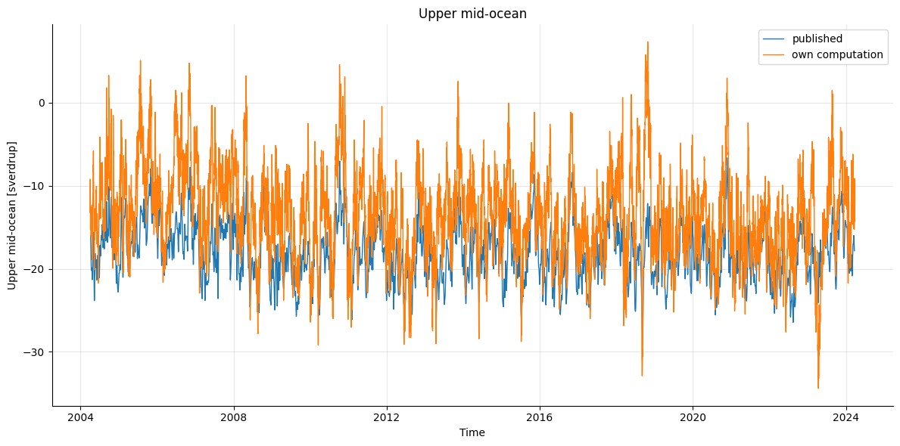
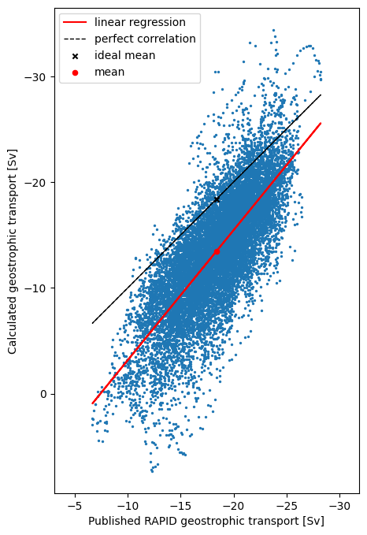
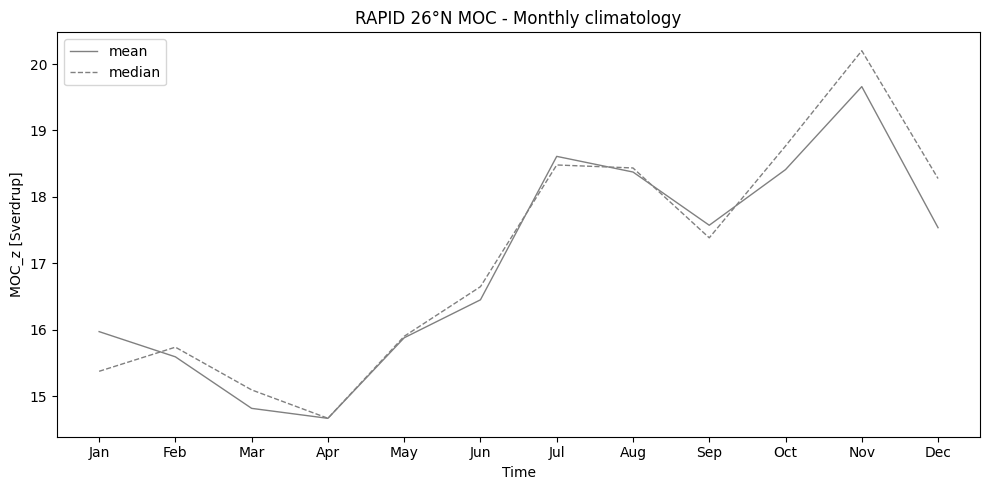
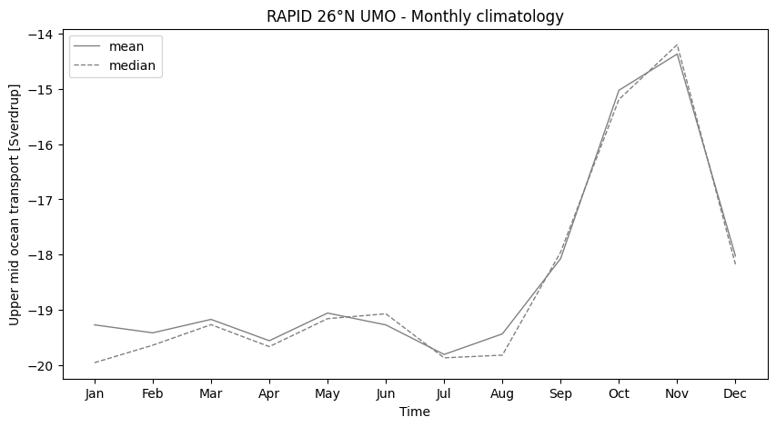
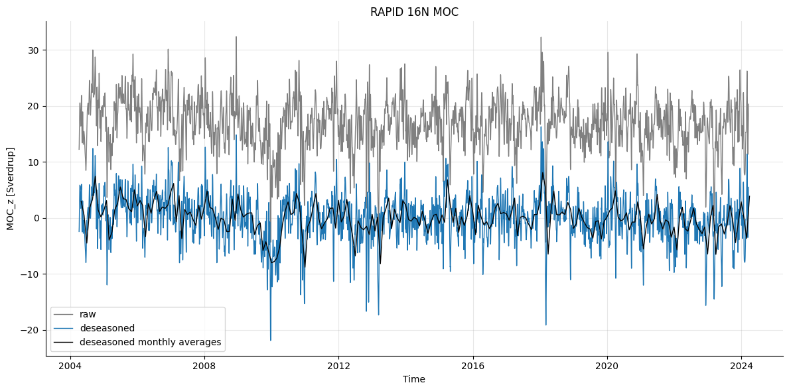
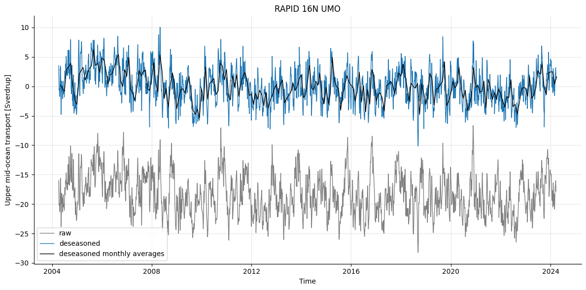
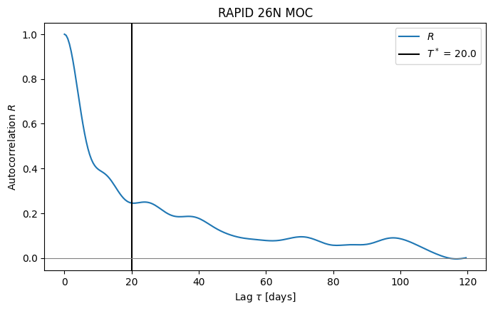
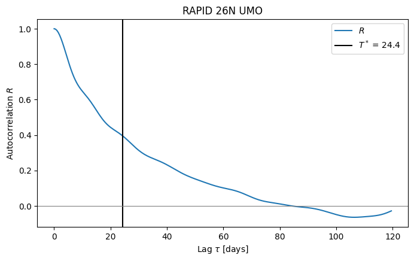
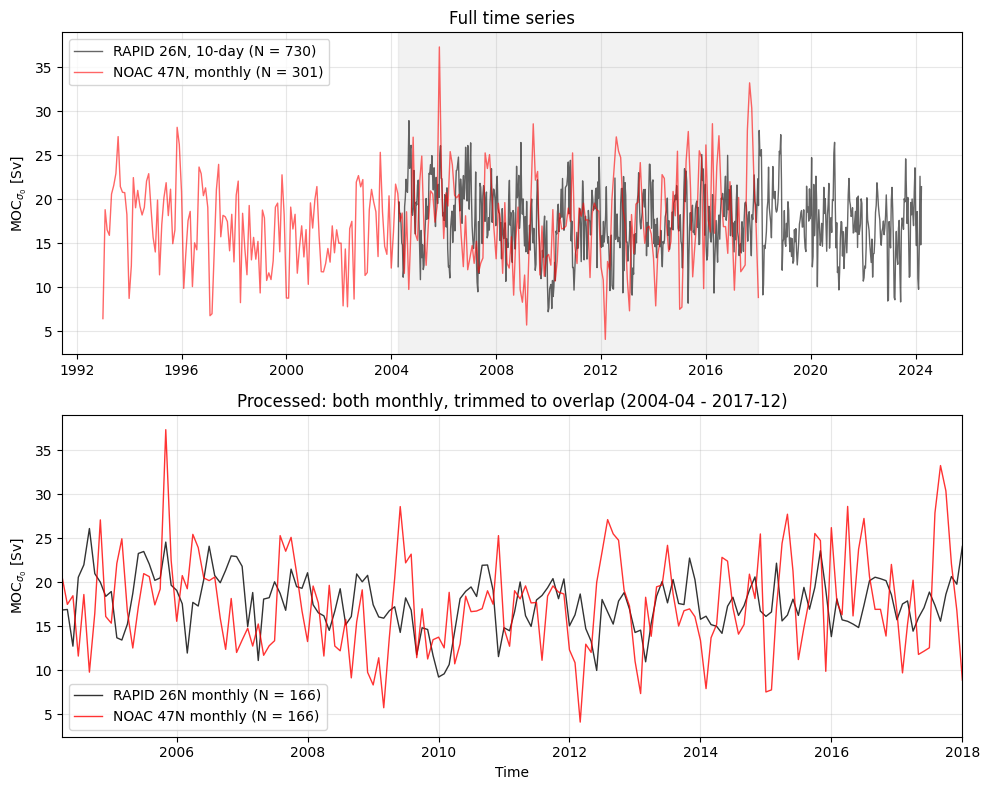
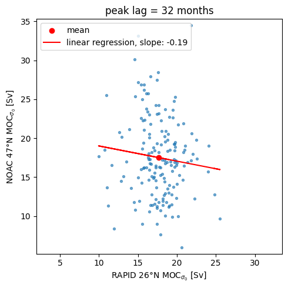

# Assignment 2: Geostrophic transport and relating AMOC series

## Part 1 - Geostrophic transport
<!-- 
- comment on extra variance + why it differs from published product
 -->

The RAPID-AMOC 26°N array [1] is a mooring array monitoring the Atlantic Meridional Overturning Circulation (AMOC) at 26°N.
The dataset includes 14,599 observations made at 12 hour intervals from April 2004 until March 2024, spanning a total of 20 years.

This dataset was used to compute the upper mid-ocean (UMO) geostrophic transport, in order to compare the result with the published UMO transport.
It is estimated from the zonal geostrophic (thermal-wind) shear between the eastern and western boundary moorings and is integrated only from the surface to about 1100 m, rather than over the full depth, because that depth range isolates the upper limb of the meridional overturning circulation.
Across the mid-ocean, northward flow above the thermocline is cancelled by southward flow below, so a full depth integral would nearly vanish.

The results of the manually computed UMO geostrophic transport along with the published values is shown in the following figure:

It is evident that the manual geostrophic transport computation results in weaker UMO transport than what was published.
Additionally, the estimated transport has some positive values, while the published product is strictly negative. Since the sign denotes direction here (positive northward, negative southward), the estimated UMO transport changes direction, while the published transport is purely southward, which is more sensible physically.

The correlation between the two series is 0.76, suggesting that the computed values are correlated with the published transport, but don't match the values exactly.
This is further illustrated by the following scatter plot, showing the calculated against the published result:

The estimated transport has a larger range than the published values, suggesting that some of the variance was removed before publication.
The linear regression and mean (shown in red) are lower than the theoretical slope and mean for perfect correlation, showing that the estimated transport underestimates the strength of the geostrophic transport compared to the published transport (note that the negative sign simply denotes southward direction).

The published product splits the ocean interior at the Mid-Atlantic Ridge (MAR), computing thermal wind west and east of the MAR separately. It also applies a mass-balance adjustment, which is why the published result has a lower variance and stronger transport.

## Part 2 - Evaluating time series

### 2A - Single series: seasonal cycle and trend

<!--
- report autocorrelation
- include effective sample size
- report p-values (using effective sample size)
-->

In this part, meridional overturning ($MOC_z$) and upper mid-ocean transport (UMO) from the RAPID-AMOC 26°N array [1] were used to study each transport's seasonal cycle, autocorrelation and trend.

During preprocessing, missing values were removed from each dataset.

#### Seasonal cycle

The following figures show the seasonal cycle of the meridional overturning transport and the upper mid-ocean transport, respectively:

The MOC is strongest in November, followed by July and August. It is weakest in boreal winter and spring.
Conversely, the UMO transport stays roughly constant between -19 and -20 Sv throughout boreal winter, spring and summer, and becomes around 5 Sv weaker in boreal autumn.

#### Deseasonalised time series

Removing these seasonal patterns, the changes in meridional overturning and upper mid-ocean transport over the years can be studied more easily.
In the following two plots the unprocessed data is depicted in grey, while the deseasonalised time series is shown in blue with monthly averages overlayed in black.

#### Autocorrelation

These figures show the autocorrelation of MOC and UMO, respectively:

#### Trend

The linear trend for each series was computed, along with the standard error and p-value, both with and without accounting for effective sample size $T^*$.
The results are summarized in the following table:

|                  | MOC                          | UMO                          |
| ---------------- | ---------------------------- | ---------------------------- |
| slope            | -0.949 $\pm$ 0.540 Sv/decade | -1.063 $\pm$ 0.458 Sv/decade |
| $SE_{naive}$     | 0.063 Sv/decade              | 0.048 Sv/decade              |
| $SE_{eff}$       | 0.540 Sv/decade              | 0.458 Sv/decade              |
| $slope/SE$       | -15.131 $\sigma$             | -22.015 $\sigma$             |
| $slope/SE_{eff}$ | -1.758 $\sigma$              | -2.320 $\sigma$              |
| $N_{eff}$        | 197                          | 162                          |
| $p_{naive}$      | 0.000                        | 0.000                        |
| $p_{eff}$        | 0.080                        | 0.022                        |
| 95% significance | no                           | yes                          |

Both series have a similar trend of around -1 Sv per decade, suggesting there is similar evidence for declining meridional overturning and upper mid-ocean transport.
A noteable difference is that this trend is significant at 95% for UMO, since $|slope/SE_{eff}| = |t_{eff}| = 2.320 > 1.96$, while $|t_{eff}| = 1.758 < 1.96$ for MOC, making the trend not significant at 95%.
This suggests that there is significant evidence for a declining upper mid-ocean transport, while the evidence for a declining overturning is less convincing.

Additionally, the naive significance tests have much larger values than the effective test (slope in units of effective standard error), implicating that using the raw sample size would hugely overestimate the trend's significance.  

### 2B - A pair of series: cross-correlation and lead/lag
<!-- 
- given record length and persistence of series, how many independent samples do you really have?
 -->

For this part, meridional overturning was compared at 26°N and 47°N, using again the RAPID 26°N estimates [1] and volume transport data from the NOAC array at 47°N in the subpolar North Atlantic [2].

#### Pre-processing

The RAPID dataset contains 730 values covering 20 years from April 2004 until March 2024 with one data point every ten days.

The NOAC set contains 301 values of volume transport at a monthly frequency, covering the 25 years from 1993 to 2018.

For the comparison between the series, data from only the overlapping time period (April 2004 to January 2018) was used.
Since RAPID uses a 10-day low pass filter, it was resampled to monthly averages to match the NOAC dataset.

The two time series before and after this processing can be seen here:

#### Cross-correlation

To compare the series, the cross-correlation between the transport estimates was computed for both the "raw" (resampled and trimmed to overlapping time period, but not deseasonalised) and the deseasonalised data.

The results are depicted in the following figure, with the peak correlation highlighted:

The "raw" data correlates with a peak of $|r| = 0.284$ at a lag of -40 months, while the deseasoned cross-correlation is $|r|=0.222$ at a lag of 32 months, where a negative peak lag means that transport at 47°N leads and a positive peak lag indicates transport at 26°N leading.
According to this, the transport at 26°N leads in the raw cross correlation, but in the deseasonalised case, volume transport at 47°N leads. 
This means that if the meridional overturning strengthens/weakens at 47°N, overturning at 16°N should strengthen/weaken 32 months (around 2.7 years) later.

However, since the cross-correlation is small in either case, there isn't strong evidence for such a relationship - transport at 26°N and 47°N appear only weakly correlated from these estimates.

This is further illustrated by plotting volume transport at 47°N against transport at 26°N:

The slope of the linear regression is nearly horizontal and there is no discernible pattern in the scattered points, supporting the view that these datasets do not show a significant relationship between oberturning at 26°N and 47°N.

## References

1. Moat B.I.; Smeed D.A.; Rayner D.; Johns W.E.; Smith, R.; Volkov, D.; Elipot S.; Petit T.; Kajtar J.; Baringer M. O.; and Collins, J. (2026). Atlantic meridional overturning circulation observed by the RAPID-MOCHA-WBTS (RAPID-Meridional Overturning Circulation and Heatflux Array-Western Boundary Time Series) array at 26N from 2004 to 2024 (v2024.1a), British Oceanographic Data Centre - Natural Environment Research Council, UK. doi: http://doi.org/10.5285/48d0bf43-0598-ceb2-e063-7086abc062f1
2. Wett, Simon; Rhein, Monika; Kieke, Dagmar; Mertens, Christian; Moritz, Martin; Nowitzki, Hannah (2023): Basin-wide AMOC volume transport from the NOAC array at 47°N in the subpolar North Atlantic (1993-2018) [dataset]. PANGAEA, https://doi.org/10.1594/PANGAEA.959558